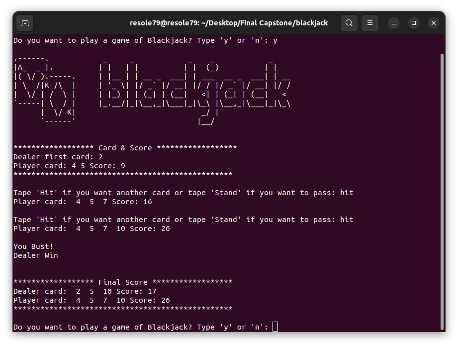

## BlackJack Game

Program for **BlackJack Game**

Blackjack is a casino banking game.     
The game is a comparing card game where each player competes against the dealer.


###### It's a part of the **#100DaysOfCode** challenge by Angela Yu. ######


#### Our Rules

 - The deck is unlimited in size. 
 - There are no jokers. 
 - The Jack/Queen/King all count as 10.
 - The the Ace can count as 11 or 1.
 - Use the following list as the deck of cards:
 - cards = [11, 2, 3, 4, 5, 6, 7, 8, 9, 10, 10, 10, 10]
 - The cards in the list have equal probability of being drawn.
 - Cards are not removed from the deck as they are drawn.
 

#### Prerequisites
You will need the following software to run the BlackJack Game:
 - [Python 3](https://www.python.org/downloads/)


#### Installation
To get started with the BlackJack Game, follow these steps:

1. **Clone** the repository:

```sh
git clone https://github.com/resole79/blackjack.git
```

2. **Run** the **blackjack.py** file:

```sh
python3 blackjack.py
```     

#### *File Structure*

 - **blackjack.py**: Main program.
 - **art.py** : File contains the draws


#### **Usage**

```
.------.            _     _            _    _            _    
|A_  _ |.          | |   | |          | |  (_)          | |   
|( \/ ).-----.     | |__ | | __ _  ___| | ___  __ _  ___| | __
| \  /|K /\  |     | '_ \| |/ _` |/ __| |/ / |/ _` |/ __| |/ /
|  \/ | /  \ |     | |_) | | (_| | (__|   <| | (_| | (__|   < 
`-----| \  / |     |_.__/|_|\__,_|\___|_|\_\ |\__,_|\___|_|\_\\
      |  \/ K|                            _/ |                
      `------'                           |__/           
```

**How program present**




## **Credit**

Author : Emilio Reforgiato (resole79)

##
<p align="right"><a href="https://www.linkedin.com/in/emilio-reforgiato/" target=”_blank” ></a></p>


